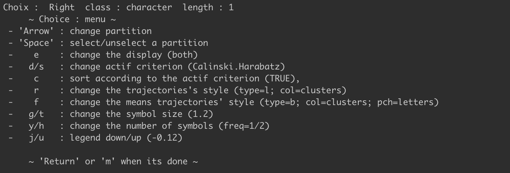

*k*-means Clustering is a very popular technique for simplifying
datasets into *archetypes* or *clusters* of observations with similar
properties. The techniques works by ‘forcing’ the observations in *k*
different groups, with *k* chosen by the analyst, such that variance
within each group is minimized. As with most statistical techniques,
this analysis needs to be conducted with judgment. Some choices of *k*
result in smaller groups for which the gain in insight is not sufficient
to warrant them being treated different. The [elbow
method](https://www.r-bloggers.com/finding-optimal-number-of-clusters/)
is a popular way to choose an appropriate value of *k*, but human
judgment is still necessary in any such method.

For the most part, *k*-means clustering is conducted on static, point in
time, observations. Examples can include clustering populations based on
a selection of demographics at a point in time, clustering patients
based on a set of medical observations at a point in time or clustering
cities based on a set of urban statistics in a given year.

Increasingly, there is a desire to cluster observations based on how
they change over time. Do they increase, decrease, stay the same? Are
they consistently high, consistently low, or do they go up and down? Are
some more complex in their changes than others?

Dealing with and preparing time series data
-------------------------------------------

To illustrate how to conduct *k*-means clustering on time series data
(or *trajectories*). I am going to use a fictional dataset of survey
responses from individuals over a five year timeframe, where the same
survey was administered annually. I am going to download this dataset
from my [Github
repo](https://github.com/keithmcnulty/longitudinal_clustering) and take
a look at it. The repo contains both a `csv` and and `RDS` version of
the data, and here I will read the `RDS` version straight into my R
session.

    library(readr)
    library(tidyverse)

    # get data straight from Github
    survey_data <- readr::read_rds(url("https://github.com/keithmcnulty/longitudinal_clustering/blob/master/survey_data.RDS?raw=true"))

    # display first 5 rows
    knitr::kable(survey_data %>% head(5))

<table>
<thead>
<tr class="header">
<th style="text-align: left;">id</th>
<th style="text-align: right;">average_rating</th>
<th style="text-align: right;">year</th>
</tr>
</thead>
<tbody>
<tr class="odd">
<td style="text-align: left;">5b758a319063cdcd1afbcfcd6173006c</td>
<td style="text-align: right;">5.720280</td>
<td style="text-align: right;">2019</td>
</tr>
<tr class="even">
<td style="text-align: left;">66cddc5ab668f44582002b973451d684</td>
<td style="text-align: right;">4.125874</td>
<td style="text-align: right;">2019</td>
</tr>
<tr class="odd">
<td style="text-align: left;">da400f831a94d78c816c413e6433b9f0</td>
<td style="text-align: right;">2.825175</td>
<td style="text-align: right;">2019</td>
</tr>
<tr class="even">
<td style="text-align: left;">55c3efe6ed30668c4c07eca7b2ed7fda</td>
<td style="text-align: right;">2.237762</td>
<td style="text-align: right;">2019</td>
</tr>
<tr class="odd">
<td style="text-align: left;">8c49365b6b11232ae24e94ad07ad8b5f</td>
<td style="text-align: right;">3.790210</td>
<td style="text-align: right;">2019</td>
</tr>
</tbody>
</table>

We can see that our data is quite simple. It looks like the survey may
have had a number of questions on it, and we have been given data on the
average rating the individual gave for all the questions. And it also
looks like there may be some different years involved. Let’s see some of
our basic stats:

    # number of individuals
    unique(survey_data$id) %>%  length()

    ## [1] 436

    # years involved
    unique(survey_data$year)

    ## [1] 2019 2018 2017 2016 2015

    # range ratings
    range(survey_data$average_rating)

    ## [1]  1 10

So it looks like we are dealing with over 400 people and five years
worth of survey data. We can reasonable assume that there is a 1 to 10
scale on the survey overall, although it would be sensible to get a copy
of the survey to confirm this. Now, we don’t know whether every
individual has data for all the years - it may be that some did not take
the survey in certain years. So it’s probably a good idea to organize
this data by individual and form a time series out of it, since that is
what we are interested in.

Essentially we want to move this data set from its current *long*
format, where each individual has a different row for each annual
observation, to a *wide* format, where each row is an individual and
each column is an observation for that individual. Let’s use our best
friend `tidyr::pivot_wider()` to do this.

    # pivot from long to wide based on year
    survey_data_wide <- survey_data %>% 
      dplyr::arrange(year) %>% 
      tidyr::pivot_wider(id_cols = id, names_from = year, values_from = average_rating)

    # show first five rows
    knitr::kable(survey_data_wide %>% head(5))

<table>
<thead>
<tr class="header">
<th style="text-align: left;">id</th>
<th style="text-align: right;">2015</th>
<th style="text-align: right;">2016</th>
<th style="text-align: right;">2017</th>
<th style="text-align: right;">2018</th>
<th style="text-align: right;">2019</th>
</tr>
</thead>
<tbody>
<tr class="odd">
<td style="text-align: left;">5b758a319063cdcd1afbcfcd6173006c</td>
<td style="text-align: right;">5.342657</td>
<td style="text-align: right;">5.153846</td>
<td style="text-align: right;">5.216783</td>
<td style="text-align: right;">4.146853</td>
<td style="text-align: right;">5.720280</td>
</tr>
<tr class="even">
<td style="text-align: left;">66cddc5ab668f44582002b973451d684</td>
<td style="text-align: right;">3.265734</td>
<td style="text-align: right;">4.965035</td>
<td style="text-align: right;">3.895105</td>
<td style="text-align: right;">1.629371</td>
<td style="text-align: right;">4.125874</td>
</tr>
<tr class="odd">
<td style="text-align: left;">da400f831a94d78c816c413e6433b9f0</td>
<td style="text-align: right;">4.335664</td>
<td style="text-align: right;">2.195804</td>
<td style="text-align: right;">1.251748</td>
<td style="text-align: right;">2.573427</td>
<td style="text-align: right;">2.825175</td>
</tr>
<tr class="even">
<td style="text-align: left;">55c3efe6ed30668c4c07eca7b2ed7fda</td>
<td style="text-align: right;">3.013986</td>
<td style="text-align: right;">3.265734</td>
<td style="text-align: right;">4.083916</td>
<td style="text-align: right;">5.027972</td>
<td style="text-align: right;">2.237762</td>
</tr>
<tr class="odd">
<td style="text-align: left;">8c49365b6b11232ae24e94ad07ad8b5f</td>
<td style="text-align: right;">4.335664</td>
<td style="text-align: right;">3.769231</td>
<td style="text-align: right;">3.643357</td>
<td style="text-align: right;">2.762238</td>
<td style="text-align: right;">3.790210</td>
</tr>
</tbody>
</table>

So we now have time series data - let’s just check if the data is
complete for all individuals:

    is.na(survey_data_wide) %>% sum()

    ## [1] 935

Clearly not - there are obviously many individuals that do not have
observations for some of these years. We should bear this in mind as we
move to the next stage.

Running *k*-means clustering on the time-series data
----------------------------------------------------

We are going to use the `kml` package in R to cluster these individuals
into a certain number of groups based on the pattern of their
trajectories. This is very easy to do if you understand how to use the
package, so this example should help you with that.

Before we can run the clustering algorithm, we need to get our data into
a shape that the algorithm understands. The `kml` algorithm expects an
object of the form `clusterLongData`, so we will need to transform our
data into this object. This object is really just the data together with
some extra information, such as where to find the actual time series in
the data.

Luckily the `kml` package has a function `cld()` to convert our data
into the required object. The function accepts an R data frame and some
extra arguments, and uses the arguments to make a `clusterLongData`
object from the dataframe. In particular, this function needs to know
two important things:

1.  The `timeInData` argument tells the function which numeric columns
    are the timeseries columns. In our case it is all columns except the
    first column, so `2:6`.

2.  The `maxNA` argument tells the function to ignore certain
    observations if there are too many `NA` values. In this case, it
    seems silly to me to try to cluster any individual who has more that
    two `NA` observations out of five.

<!-- -->

    # ensure data is in a data frame (cld also accepts a matrix but no other data type)
    survey_data_wide <- as.data.frame(survey_data_wide)

    # create clusterLongData object
    survey_data_cld <- kml::cld(survey_data_wide, timeInData = 2:6, maxNA = 2)

    # inspect object
    class(survey_data_cld)

    ## [1] "ClusterLongData"
    ## attr(,"package")
    ## [1] "kml"

It looks like we have successfully made the conversion. Now we can run
the `kml` algorithm. The algorithm runs through:

1.  Different values of *k* according to the argument `nbCluster`. The
    default is 2 to 6 clusters.
2.  Several iterations of each clustering using different staring
    points. The default is 20, but this can be adjusted using the
    `nbRedrawing` argument.

Usually, if you don’t mess with the more geeky arguments of the kml
function, the algorithm will run in its fast version, which is optimized
to be very fast. Also, `kml` writes the clustering results into your
`clusterLongData` object so you don’t need to create a new object here.

Let’s say that I am happy with looking at up to six clusters but I only
want five redrawings of each.

    # run kml with 2-6 clusters and five redrawings for each

    kml::kml(survey_data_cld, nbRedrawing = 5)

    ##  ~ Fast KmL ~
    ## *************************S

So that looks promising. But this is all a bit abstract - how do I see
results?

To look at results, and make a choice on which clustering you would like
to proceed with, you can use the `choice()` function. This will open an
interactive panel that you can use to view the different clusterings,
choose one you are interested in and download the data on which
individual fell into which cluster based on your choice.

In Windows, this function should work without any problems, on a Mac or
Linux machine you may need to open your X11 console before you run this.

    # on Mac or Linux you may need to enable X11 console first

    if (.Platform$OS.type != "windows") {
      X11(type = "Xlib")
    }

    # run choice

    kml::choice(survey_data_cld)

If your command succeeds here, you should see a screen that you can
interact with like I am doing in this video:

<video width="320" height="240" controls>
<source src="choice.mp4" type="video/mp4">
Your browser does not support the video tag. </video>

On the left are the various values of *k* and you can move them up or
down using the arrow keys, while you can move left or right to see the
different redrawings for each *k*. The full navigation instructions
should be visible in your R console window, like this:

Selecting a clustering
----------------------

As you navigate the different clusters you might take several factors
into account in deciding which clustering is most useful to you:

1.  The sorting scale on the left uses the Calinski-Harabasz Index to
    provide a score on the ‘quality’ of the clustering. For more on
    measures of cluster quality, including Calinski-Harabasz, see [this
    paper](http://datamining.rutgers.edu/publication/internalmeasures.pdf).
    In practical terms, this is simply stating the obvious: that as you
    move to more and more clusters, the statistics of each cluster
    become less reliable. You should, however, be careful if there is a
    big drop in quality when you are moving left-to-right through
    redrawings of the same *k*. There is no “minimum quality” that I am
    aware of, so this should be used as directional guidance.

2.  The size of each cluster. If you choose three clusters for example,
    but one of them only has 1% of your sample, that may not be
    particularly useful. The statistics on cluster proportions at the
    top of the graph should be helpful in your evaluation of this.

3.  The trajectories themselves - given by the colored lines. You will
    likely be seeking to identify trajectories that support your
    objective. At the end of the video, for example, I identify four
    useful trajectories - permanently low, permanently high, one moving
    from low to high and the other moving in the opposite direction. If
    this was an employee satisfaction survey, for example, you may be
    interested in exploring each of these groups more to better
    understand these patterns.

When you have selected a drawing of a particular clustering that you
believe is helpful, you can formally select it by pressing the space key
(**don’t forget this step**). Then you can exit your view by pressing
the `m` key. At the point of exit, various files on your selected
clustering will be written to your project folder, including `csv` files
with cluster details and statistics and a mapping of each observation to
a cluster, as well as graphics showing the cluster trajectories. You can
find the files for my choice in the [Github
repo](https://github.com/keithmcnulty/longitudinal_clustering) for this
project.

Next steps
----------

Assuming the survey is not anonymous, or that you have at least some
demographic data on the respondents, you can use your clustering output
and join it to that demographic data to try to see what the clusters you
have identified have in common. This can help you with targeted actions
against the different clusters, or to help illustrate where the
different pockets of satisfaction or sentiment may lie in the
organization.

In a similar way, if this were clinical trial data and the time periods
were patient obs on the treated condition, you could join the clusters
to other patient data to determine where the trial has been particularly
effective or ineffective.
